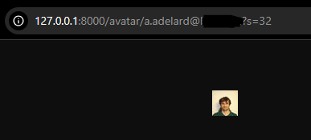
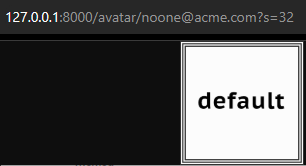

# What is it?

This is the ```rust_ad_vatar``` - simple but ready-to-use service that implements smallest subset of LibreAvatar API.
Its purpose is to pull an employee photo from corporate LDAP directory - be it OpenLDAP/389ds/FreeIPA, 
or an ActiveDirectory - and represent via very specific REST API to any API-consuming service.

## Usage guide

Some companies deliberately choose on-premise GitLab hosting due to miscellaneous requirements, and sometimes they 
just want to use official photos from internal directory service as employees' GitLab avatars, without allowing 
for a broader Internet access.

What's the solution? Pretty easy. You just have to deploy rust_ad_vatar and point it to your internal directory. 
API is intentionally mimics a subset of LibreAvatar's API, and due to GitLab's flexibility, you will be up and running 
with employee's avatars without a hassle.

Here's a [link to official guide from GitLab](https://docs.gitlab.com/ee/administration/libravatar.html). 
According to it, you just have to set parameter as follows:

```
gitlab_rails['gravatar_enabled'] = true
gitlab_rails['gravatar_plain_url'] = "http://<your-rust-ad-vatar-URL>:8000/avatar/%{email}?s=%{size}"
```

Let's check it via ol' good browser:



How's about non-existent email?



That's all, in fact.

Unfortunately, at the moment being port is fixed - I mean, you're always welcome to send me a PR.

## TODO

1. Add LDAPS support for the LDAP client part 
2. Add HTTPS support for the HTTP server part
3. Add HTTP port number setting
4. ?..
